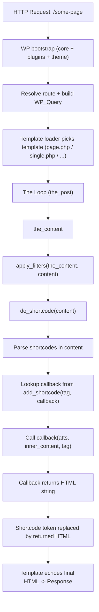

# Plugin Fundamentals (Hooks, Shortcode, Assets)

## 1) Plugin là gì trong WordPress

Plugin là package PHP được WordPress load để:

- Hook vào lifecycle (actions/filters)
- Register shortcode, REST routes, AJAX handlers
- Enqueue JS/CSS
- Tạo custom admin pages (nếu cần)

Trong assessment, plugin là “container” chính để bạn:

- Tạo page/form tạo product ngoài admin
- Tạo Elementor widget (cũng là plugin)

## 2) Plugin header & entrypoint

### Tip: Tạo plugin nhanh bằng WP-CLI

Thay vì tạo file thủ công, bạn có thể dùng WP-CLI trong môi trường local để tạo nhanh cấu trúc chuẩn:

```bash
# Trong thư mục devtools/vocalmeet/local
just wp scaffold plugin vocalmeet-woo-api --plugin_name="Vocalmeet Woo API" --plugin_description="Task 4.I-II"
```

Một plugin tối thiểu cần:

- File PHP chính chứa plugin header (metadata)
- Code bootstrap để register hooks

Tư duy entrypoint:

- Giữ entrypoint mỏng: chỉ load class/functions cần thiết
- Không chạy logic nặng ngay khi file được include; dùng hooks để chạy “đúng thời điểm”

### 2.1) Entrypoint file có bắt buộc trùng tên plugin không?

Không bắt buộc.

WordPress sẽ scan các file `.php` ở root của mỗi thư mục plugin trong `wp-content/plugins/`.
File nào có “plugin header” hợp lệ (ví dụ `Plugin Name: ...`) thì sẽ xuất hiện trong trang Plugins và được dùng như main plugin file.

Quy ước phổ biến (nên làm):

- Folder: `wp-content/plugins/vocalmeet-hooks-lab/`
- Entrypoint: `vocalmeet-hooks-lab.php` (trùng với tên folder)

Bạn vẫn có thể đặt tên khác như `plugin.php` hoặc `main.php` nếu muốn, miễn là file đó nằm ở root plugin folder và có plugin header.

## 3) Shortcode vs Page template vs Block

Để “nhúng UI” vào một WordPress Page, có 3 cách phổ biến:

- **Shortcode**: đơn giản, phù hợp assessment.  
  Bạn viết `[vocalmeet_product_form]` và render HTML.
- **Block (Gutenberg)**: chuẩn mới, mạnh nhưng setup phức tạp hơn.
- **Page template** (theme): dễ bị phụ thuộc theme; không phù hợp khi muốn plugin độc lập.

### 3.1) Shortcode (plugin-owned UI embedding)

Shortcode là một “placeholder token” bạn đặt trong content, dạng:

- `[tag]`
- `[tag attr="value"]`
- `[tag]inner content[/tag]`

Khi WordPress render page/post, nó sẽ:

- lấy raw content (text + HTML + shortcode tokens) từ database
- chạy filter `the_content`
- trong quá trình đó, gọi `do_shortcode` để thay shortcode token bằng HTML do plugin trả về

Tư duy đơn giản:

- Bạn viết `[vocalmeet_product_form]` trong content
- WordPress thay đoạn đó bằng output của callback bạn đăng ký qua `add_shortcode('vocalmeet_product_form', ...)`

Khi dùng shortcode, “điểm nối” giữa page content và plugin là:

- user đặt shortcode vào content
- WordPress gọi callback của shortcode để lấy HTML render

### 3.1.0) Shortcode “xuất hiện ở đúng chỗ nào trên page”?

WordPress không “tự đoán” vị trí hiển thị. Vị trí là do theme/template quyết định.

Hai lớp bạn cần phân biệt:

- **Theme template**: quyết định layout của trang (header, footer, sidebar, content ở giữa).
- **Post/Page content**: là nội dung bạn nhập trong editor (nơi bạn đặt shortcode).

Theme thường có đoạn tương đương:

- in “classic themes”: file `page.php`, `single.php` gọi `the_content()` trong khu vực main content.
- in “block themes”: template HTML cũng có block “post content”.

Vì shortcode là một phần của “content”, nên nó sẽ render đúng tại vị trí bạn đặt shortcode trong editor, bên trong khu vực mà theme render content.

Ví dụ: bạn viết content của Page như sau:

```text
Hello world (đoạn text 1)

[vocalmeet_product_form title="Create product"]

Goodbye (đoạn text 2)
```

Khi render, phần output trong khu vực content sẽ có dạng:

- text 1
- HTML do shortcode callback trả về
- text 2

Ví dụ tối thiểu:

```php
<?php

add_action('init', function () {
    add_shortcode('vocalmeet_product_form', function ($atts) {
        $atts = shortcode_atts(
            [
                'title' => 'Create product',
            ],
            $atts
        );

        $html  = '<div class="vocalmeet-product-form">';
        $html .= '<h3>' . esc_html($atts['title']) . '</h3>';
        $html .= '<form method="post">';
        $html .= '<label>Product name <input name="name" /></label><br />';
        $html .= '<label>Price <input name="price" /></label><br />';
        $html .= '<button type="submit">Submit</button>';
        $html .= '</form>';
        $html .= '</div>';

        return $html;
    });
});
```

Điểm cần hiểu sâu:

- Shortcode callback phải **return string**, không `echo`.
- Escape đúng context (`esc_html`, `esc_attr`) vì dữ liệu có thể từ user.
- Đừng xử lý POST trực tiếp trong shortcode nếu bạn muốn UX tốt; thường dùng REST/AJAX.

### 3.1.2) Minh hoạ “vì sao WordPress biết chèn đúng chỗ”

Nếu tưởng tượng theme template là:

```text
<header>...</header>
<main>
  (in content here)
</main>
<footer>...</footer>
```

Thì `the_content()` chính là chỗ theme “đổ” content vào `(in content here)`.
Và trong content có `[tag]` nên `do_shortcode` sẽ thay token đó bằng HTML.

Nên câu trả lời là:

- WordPress biết “chỗ đặt shortcode trong content”
- Theme biết “chỗ đặt content trong layout”

### 3.1.1) Diagram: WordPress gọi shortcode như thế nào

Một số Markdown renderer không hỗ trợ Mermaid. Dưới đây là diagram dạng ASCII (render được ở mọi nơi):

```text
Browser
  |
  v
HTTP Request: /some-page
  |
  v
WordPress bootstrap (core + plugins + theme)
  |
  v
WP_Query resolves route + selects template (page.php / single.php / ...)
  |
  v
The Loop -> the_content()
  |
  v
apply_filters('the_content', $content)
  |
  v
do_shortcode($content)
  |
  v
parse [tag attr="..."]...[/tag]
  |
  v
callback registered by add_shortcode('tag', callback)
  |
  v
callback returns HTML string
  |
  v
shortcode text replaced by returned HTML
  |
  v
template echoes final HTML -> Response
```

Nếu môi trường của bạn hỗ trợ Mermaid thì có thể dùng bản này:



### 3.2) Page Template (theme-owned routing/rendering)

Page template là “file template” trong theme, ví dụ:

- `page-my-custom.php` hoặc template với header `Template Name: ...`

Ví dụ minimal template file trong theme:

```php
<?php
/*
Template Name: Vocalmeet Custom Page
*/

get_header();
echo '<h1>Custom Page</h1>';
get_footer();
```

Vì sao không phù hợp trong assessment nếu mục tiêu là plugin độc lập:

- template sống trong theme → portability kém
- review khó hơn (bị phân tán giữa theme/plugin)

Vẫn có thể dùng trong local để học, nhưng để “deliver” assessment thường nên đi theo plugin (shortcode/REST).

### 3.3) Block (Gutenberg) (editor-native component)

Block là “component” chuẩn của block editor:

- UI kéo thả trong editor
- có thể render phía server (PHP) hoặc phía client (JS)

Ví dụ block server-side tối thiểu (dynamic block):

```php
<?php

add_action('init', function () {
    register_block_type('vocalmeet/hello-block', [
        'render_callback' => function ($attributes) {
            $message = isset($attributes['message']) ? (string) $attributes['message'] : 'Hello';
            return '<p>' . esc_html($message) . '</p>';
        },
        'attributes' => [
            'message' => [
                'type' => 'string',
                'default' => 'Hello from block',
            ],
        ],
    ]);
});
```

Trade-off thực tế:

- Block là hướng “chuẩn hiện đại”, nhưng setup/bundling JS có thể nặng hơn shortcode.
- Với assessment này bạn đã phải làm Elementor widget (JS/editor-heavy), nên phần page tạo product thường chọn shortcode + REST cho đơn giản.

## 4) Enqueue assets (JS/CSS) đúng cách

Nguyên tắc:

- Chỉ enqueue khi cần (đúng page, đúng shortcode, đúng editor)
- Tách editor assets và frontend assets nếu UI chạy ở Elementor editor

Concept quan trọng:

- WordPress có dependency management cho scripts (handle, deps, version).
- Bạn sẽ thường cần “bridge” dữ liệu từ PHP sang JS:
  - REST endpoint URL
  - nonce
  - settings

## 5) Activation/Deactivation hooks (khi nào cần)

Bạn dùng activation hook khi cần:

- Tạo options mặc định
- Tạo custom tables (assessment này thường không cần)

Nếu chỉ làm REST/AJAX và tạo product qua WooCommerce thì thường không cần activation logic phức tạp.

### 5.1) Activation hook: chạy đúng 1 lần khi plugin được activate

Activation hook chạy khi user bấm “Activate” trong Plugins screen.
Nó phù hợp để:

- set default options
- flush rewrite rules (khi plugin đăng ký rewrite)

Ví dụ:

```php
<?php

register_activation_hook(__FILE__, function () {
    add_option('vocalmeet_hooks_lab_trace_enabled', 0);
});
```

### 5.2) Deactivation hook: dọn dẹp “behavior” (không xoá dữ liệu mặc định)

Deactivation hook chạy khi user bấm “Deactivate”.
Thường dùng để:

- flush rewrite rules
- tắt scheduled events (cron) do plugin tạo

Ví dụ:

```php
<?php

register_deactivation_hook(__FILE__, function () {
    wp_clear_scheduled_hook('vocalmeet_some_cron_hook');
});
```

### 5.3) Uninstall (khác activation/deactivation)

Nếu muốn xoá dữ liệu khi uninstall (xóa plugin), WordPress có “uninstall” mechanism.
Tư duy đúng:

- deactivate: thường không xoá data (để user bật lại không mất)
- uninstall: mới cân nhắc xoá options/custom tables (tuỳ policy)

## 6) Gợi ý “mẫu” cấu trúc plugin dễ maintain

Không có một chuẩn duy nhất, nhưng nên có:

- `includes/` (PHP classes)
- `assets/` (js/css)
- `templates/` (php render templates, nếu muốn tách view)

Điểm quan trọng là “boundary”:

- File render template không chứa logic gọi API.
- Logic gọi API/validate/authorize nằm trong class handler.

### 6.1) Quy ước folder/file phổ biến trong WordPress plugin

WordPress core không bắt buộc một folder structure duy nhất, nhưng ecosystem thường hội tụ vài pattern:

- 1 file entrypoint ở root plugin (plugin header + bootstrap)
- `includes/` cho PHP classes (service/handler/controller-like)
- `assets/` cho JS/CSS (chia `js/`, `css/`)
- `templates/` cho PHP view templates
- `languages/` cho translations (nếu làm i18n)

### 6.2) Map structure của plugin “vocalmeet-hooks-lab” (vì sao như vậy)

Plugin bạn vừa tạo:

```
wp-content/plugins/vocalmeet-hooks-lab/
├── vocalmeet-hooks-lab.php
└── includes/
    ├── class-hooks-lab.php
    └── class-hooks-lab-rest.php
```

Ý nghĩa:

- `vocalmeet-hooks-lab.php`: entrypoint, giữ mỏng, chỉ `require_once` classes và register trên `plugins_loaded`.
- `class-hooks-lab.php`: nơi tập trung “hook registrations” + core behaviors (init priority, filter, shortcode, trace).
- `class-hooks-lab-rest.php`: tách riêng REST routes để:
  - boundary rõ ràng (REST concerns tách khỏi core behaviors)
  - dễ mở rộng (thêm endpoint) mà không làm file core phình to

Điểm bạn nên học từ structure này:

- “Một file = một nhóm trách nhiệm”
- Entry point không chứa logic; logic nằm trong class/method có tên rõ
- Hook registrations tập trung ở `register()` để dễ đọc lifecycle

## 7) Curl test REST API (Hooks Lab plugin)

Các endpoint theo plan:

- `GET  /wp-json/vocalmeet/v1/hooks-lab/ping` (public)
- `POST /wp-json/vocalmeet/v1/hooks-lab/reset` (admin)
- `POST /wp-json/vocalmeet/v1/hooks-lab/trace` (admin, requires `enabled`)

### 7.1) Set biến môi trường (không hardcode credentials)

```bash
export WP_BASE_URL='http://localhost'
export WP_USER='admin'
export WP_APP_PASS='PASTE_YOUR_APPLICATION_PASSWORD_HERE'
```

Lưu ý:

- Application Password trong WP admin thường hiển thị có khoảng trắng; có thể giữ nguyên nhưng phải bọc trong quotes.
- Không commit credentials vào git và không paste trực tiếp vào tài liệu trong repo.

### 7.2) Ping (public)

```bash
curl -sS "${WP_BASE_URL}/wp-json/vocalmeet/v1/hooks-lab/ping" | jq
```

Nếu máy bạn chưa có `jq`:

```bash
curl -sS "${WP_BASE_URL}/wp-json/vocalmeet/v1/hooks-lab/ping"
```

### 7.3) Reset init order (admin + Application Password)

```bash
curl -sS \
  -u "${WP_USER}:${WP_APP_PASS}" \
  -X POST \
  "${WP_BASE_URL}/wp-json/vocalmeet/v1/hooks-lab/reset" | jq
```

### 7.4) Toggle trace (admin + Application Password)

Enable:

```bash
curl -sS \
  -u "${WP_USER}:${WP_APP_PASS}" \
  -X POST \
  -H 'Content-Type: application/json' \
  -d '{"enabled":true}' \
  "${WP_BASE_URL}/wp-json/vocalmeet/v1/hooks-lab/trace" | jq
```

Disable:

```bash
curl -sS \
  -u "${WP_USER}:${WP_APP_PASS}" \
  -X POST \
  -H 'Content-Type: application/json' \
  -d '{"enabled":false}' \
  "${WP_BASE_URL}/wp-json/vocalmeet/v1/hooks-lab/trace" | jq
```
